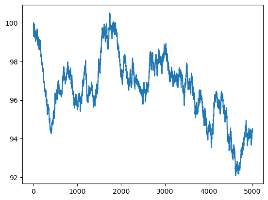
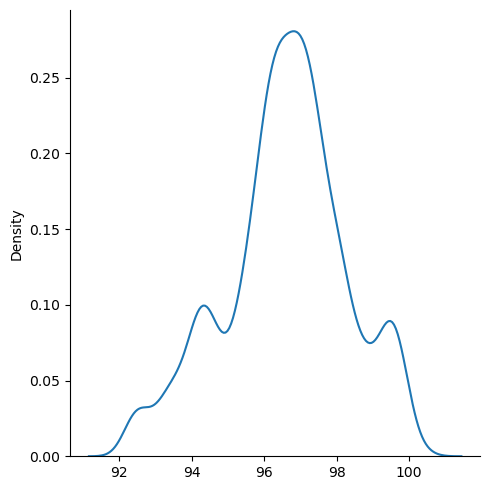
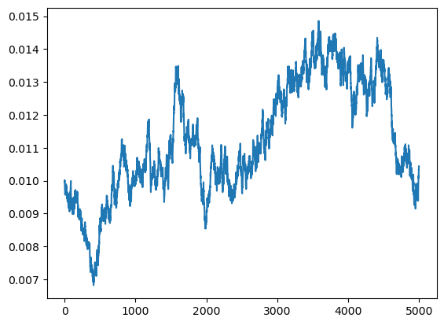
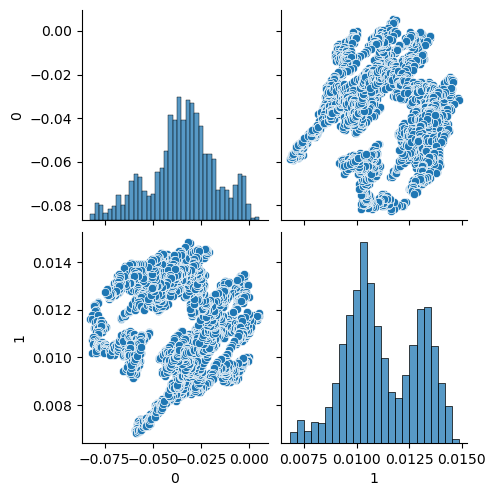
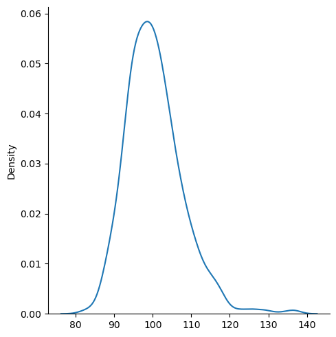

# Heston-implement
 a report for implementing Heston model
 
 In this project, I try to implement the Heston model via standard inverse Fourier transform method showed in Heston(1993).

 I will simulate the same option price as well, left for comparison.

# Simulated price and volatility time-series

Above is simulated price time series, with parameters presented in Heston(1993). I change rho = 0.7 to show the rho effect. Please refer to src\heston.py for detailed parameter definition illustration.

Above is kerel density estimation, summarizing the simulated price time series. 

Time series of volatility, which obeys OU process.

Joint map shows that serious correlation between log return x, and volatility v, which are shown in graph as 0 and 1.

# Heston model
I have no intention to wholy derive the Heston model.
Besides Heston (1993), I would like to recommand Rouah(2013) for detailed illustration of Heston model.

In heston model or even more broader sense, call option price can be calculated as 
$$C(K) = S_t P_1 - K e^{- r \tau} P_2$$
In file src\heston.py, I use numerical methods to calculate the fourier integration, where
$$P_j(x, v, T ; \ln (K))=1/2+1/\pi \int_0^{\infty} {Re}[{e^{-i \phi \ln [K]} f_j(x, v, T ; \phi)}/{i \phi}] d \phi$$.
$f_j$ is the characteristic function.

We compare the two methods, with little difference.

At last, I present the cross-sectional price kernel density estimation.
